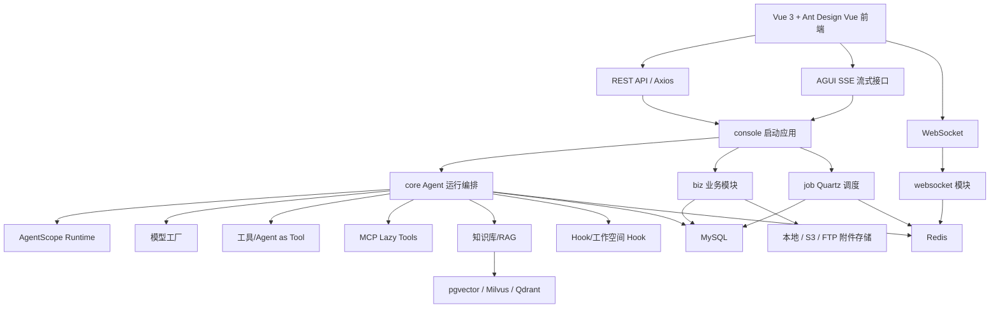
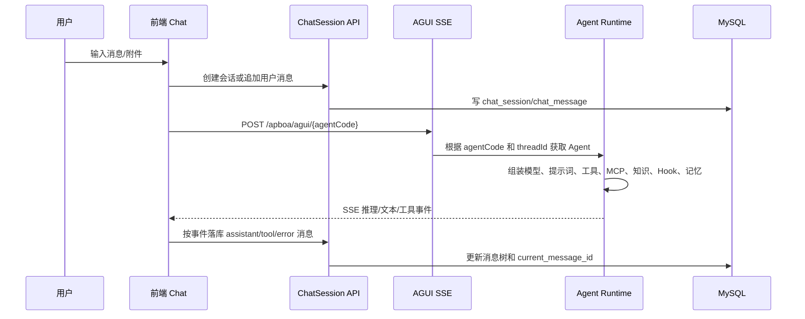
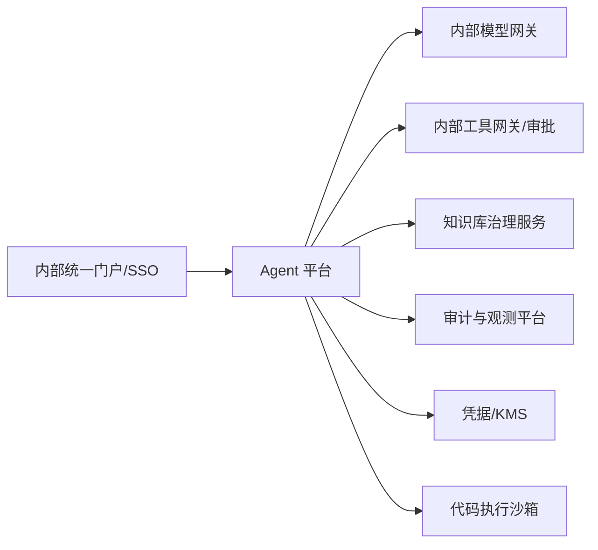

# Apboa 企业内部 Agent 平台系统详细设计报告

## 1. 文档说明

本文基于当前仓库 `.apboa` 目录下的 Apboa 代码进行静态分析，目标是为后续“基于 Apboa 搭建企业内部 Agent 平台”提供系统级详细设计依据。报告重点覆盖当前系统架构、核心模块职责、运行链路、数据模型、接口边界、技术栈版本基线，以及后续与内部统一技术栈和版本号时的调整建议。

当前分析范围：

- 后端：`.apboa/pom.xml`、`.apboa/common`、`.apboa/core`、`.apboa/console`、`.apboa/biz`、`.apboa/job`、`.apboa/cluster`、`.apboa/websocket`、`.apboa/security`
- 前端：`.apboa/ui`
- 数据库：`.apboa/docs/schema.sql`、`.apboa/docs/once_db_init/db_init.sql`、`.apboa/docs/*.sql`
- 部署：`.apboa/docker`

## 2. 系统定位

Apboa 是一个基于 AgentScope 的企业级智能体平台，提供智能体配置、模型接入、提示词、工具、技能包、MCP、知识库/RAG、Hook、会话、定时任务、工作空间、鉴权和多节点通信等能力。当前代码已经具备可视化 Agent 平台的基本闭环：管理员配置智能体和能力模块，用户在前端 Chat 页面发起 AGUI 流式请求，后端按智能体定义动态组装 AgentScope `ReActAgent` 或 A2A Agent，并通过数据库、Redis、WebSocket 和向量库支撑运行态能力。

对企业内部平台而言，建议将 Apboa 定位为“Agent 编排与运行控制层”，而不是单纯的大模型调用代理。内部改造应重点围绕统一技术栈版本、内部认证、组织权限、模型网关、工具安全、审计、运维和知识库治理进行。

## 3. 当前技术栈与版本基线

### 3.1 后端版本

| 类型 | 当前版本/实现 | 来源 |
| --- | --- | --- |
| Java | 21 | `.apboa/pom.xml`、README |
| Spring Boot | 3.4.9 | `.apboa/pom.xml` |
| AgentScope | 1.0.12 | `.apboa/pom.xml` |
| MyBatis-Plus | 3.5.7 | `.apboa/pom.xml` |
| MySQL Driver | 8.0.33 | `.apboa/pom.xml` |
| Druid | 1.2.19 | `.apboa/pom.xml` |
| Lombok | 1.18.30 | `.apboa/pom.xml` |
| Groovy | 4.0.14 | `.apboa/pom.xml` |
| Guava | 31.1-jre | `.apboa/pom.xml` |
| JJWT | 0.13.0 | `.apboa/pom.xml` |
| Hutool | 5.8.4 | `.apboa/pom.xml` |
| Anthropic Java SDK | 2.14.0 | `.apboa/common/pom.xml` |
| OpenAI Java SDK | 4.18.0 | `.apboa/common/pom.xml` |
| Google GenAI SDK | 1.38.0 | `.apboa/common/pom.xml` |
| Nacos Client | 3.1.1 | `.apboa/biz/a2a/pom.xml` |
| Qdrant Client | 1.17.0 | `.apboa/common/pom.xml` |
| Milvus SDK | 2.6.8 | `.apboa/common/pom.xml` |
| Apache Tika | 2.9.2 | `.apboa/common/pom.xml` |
| JGit | 7.3.0.202506031305-r | `.apboa/common/pom.xml` |
| ANTLR Runtime | 4.13.1 | `.apboa/security/script-security/pom.xml` |
| Rhino | 1.7.14 | `.apboa/security/script-security/pom.xml` |
| JUnit | 父 POM 为 3.8.1，script-security 为 JUnit 5.10.1 | `.apboa/pom.xml`、`.apboa/security/script-security/pom.xml` |

注意：父 POM 中 `commons-net.version` 定义了两次，分别为 `3.9.0` 和 `3.6`，后者会覆盖前者。README 技术栈表写的是 AgentScope 1.0.8，但父 POM 实际为 1.0.12，需要在内部版本统一阶段修正。

### 3.2 前端版本

| 类型 | 当前版本/实现 | 来源 |
| --- | --- | --- |
| Vue | ^3.5.27 | `.apboa/ui/package.json` |
| TypeScript | ~5.9.3 | `.apboa/ui/package.json` |
| Vite | ^7.3.1 | `.apboa/ui/package.json` |
| Ant Design Vue | ^4.2.6 | `.apboa/ui/package.json` |
| Pinia | ^3.0.4 | `.apboa/ui/package.json` |
| Vue Router | ^5.0.1 | `.apboa/ui/package.json` |
| Axios | ^1.7.9 | `.apboa/ui/package.json` |
| CodeMirror | 6.x | `.apboa/ui/package.json` |
| Mermaid | ^11.14.0 | `.apboa/ui/package.json` |
| ECharts | ^6.0.0 | `.apboa/ui/package.json` |
| Node 运行要求 | ^20.19.0 或 >=22.12.0 | `.apboa/ui/package.json` |
| Maven 前端插件 Node | v20.19.0 | `.apboa/ui/pom.xml` |
| Maven 前端插件 pnpm | 9.4.0 | `.apboa/ui/pom.xml` |

### 3.3 基础设施版本

| 组件 | 当前配置 |
| --- | --- |
| MySQL | docker-compose 使用 `mysql:8.0` |
| Redis | docker-compose 使用 `redis:7-alpine` |
| pgvector | docker-compose 使用 `pgvector/pgvector:pg16` |
| 后端基础镜像 | Maven `3.9-eclipse-temurin-21`，JRE `eclipse-temurin:21-jre` |
| 前端基础镜像 | Node `22-alpine`，Nginx `alpine` |

## 4. 总体架构设计

### 4.1 逻辑架构



### 4.2 物理部署架构

当前 docker-compose 提供前后端分离部署：

- `apboa-frontend`：Nginx 承载前端构建产物。
- `apboa-backend`：Spring Boot 后端，监听 `3060`。
- `apboa-mysql`：业务库，初始化脚本来自 `.apboa/docs/once_db_init/db_init.sql`。
- `apboa-redis`：登录态、发布订阅、集群协调。
- `apboa-pgvector`：默认向量库。

后端支持横向多实例，但需要依赖 Redis 发布订阅同步 Agent 注册、WebSocket 推送、定时任务控制等运行态变化。当前 Quartz 使用自定义 Redis 分布式锁和消息通道做集群控制，而不是完整依赖 Quartz JDBC Cluster。

## 5. Maven 模块设计

### 5.1 顶层模块

| 模块 | 包装类型 | 职责 |
| --- | --- | --- |
| `cluster` | jar | Redis 发布订阅抽象，提供 `MessagePublisher`、`ChannelSubscriber` |
| `common` | jar | 实体、DTO、VO、枚举、通用配置、鉴权、MyBatis、工具类、AgentScope SDK 依赖聚合 |
| `security` | pom | 安全能力聚合，目前包含脚本安全检查 |
| `security/script-security` | jar | Shell/Python/Node.js/HTML 脚本静态安全检查 |
| `websocket` | jar | WebSocket 会话、鉴权、集群推送 |
| `biz` | pom | 业务子模块聚合 |
| `core` | jar | AgentScope 运行时装配层，负责模型、工具、MCP、知识、Hook、AGUI 注册 |
| `job` | jar | Quartz 定时任务与 Agent 周期调度 |
| `console` | jar | Spring Boot 启动入口，聚合核心业务模块 |
| `ui` | jar | Vue 前端构建，并可打包到后端静态资源 |

### 5.2 业务子模块

| 子模块 | 职责 |
| --- | --- |
| `account` | 登录、注册、Token、账号、角色、ChatKey Token |
| `agent` | 智能体定义、会话、消息树、统计、工作空间、代码执行配置、Agent ChatKey |
| `model` | 模型供应商与模型配置 |
| `prompt` | 系统提示词模板 |
| `sensitive` | 敏感词配置 |
| `tool` | 内置/动态工具管理，以及 Agent-Tool 绑定 |
| `mcp` | MCP 服务、MCP 工具目录、Agent-MCP 绑定、激活和降级 |
| `skill` | 技能包管理、导入、Skill 与 Tool 关系 |
| `knowledge` | 知识库配置与 Agent 绑定 |
| `rag` | 本地 RAG 文档上传、解析、分块、向量化、检索测试 |
| `hook` | 内置/动态 Hook 配置与 Agent 绑定 |
| `resource` | 附件、分片上传、S3/FTP/本地存储协议 |
| `params` | 系统参数配置 |
| `a2a` | Agent-to-Agent 配置，含 Nacos 相关配置 |
| `studio` | AgentScope Studio 配置 |
| `sk` | Secret Key 管理 |

### 5.3 当前依赖关系

核心依赖链为：

```text
console -> account, core, job, sk, rag
job -> core
core -> agent, resource, websocket, knowledge
agent -> hook, knowledge, mcp, model, prompt, sensitive, skill, tool, params, a2a, studio
account -> params, websocket, agent
resource -> params
rag -> common, core, knowledge, resource
websocket -> common
common -> cluster, script-security, AgentScope SDK, Spring/Middleware SDK
```

当前 `common` 模块聚合了大量第三方 SDK 和基础设施配置，实际承担了“公共模型 + 基础设施 Starter”的双重职责。后续内部化时建议拆分为 `common-api`、`common-web`、`common-infra` 或在内部工程规范下调整依赖方向，降低业务模块被动引入所有 AI/存储/向量库 SDK 的成本。

## 6. 核心运行链路设计

### 6.1 智能体配置链路

管理员通过前端业务页面配置以下资源：

- 模型供应商和模型配置：`model_provider`、`model_config`
- 系统提示词：`system_prompt_template`
- 工具：`tool_config`、`agent_tools`
- MCP：`mcp_server`、`mcp_tool`、`agent_mcp_servers`、`agent_mcp_tool`
- 技能包：`skill_package`、`agent_skill_packages`、`skill_tools`
- 知识库：`knowledge_base_config`、`agent_knowledge_bases`
- Hook：`hook_config`、`agent_hooks`
- 子 Agent：`agent_sub_agents`
- 代码执行环境：`code_execution_config`、`agent_code_execution`
- Studio：`studio_config`、`agent_studio`
- A2A：`agent_a2a`

`AgentDefinitionServiceImpl` 是智能体配置保存的核心编排服务。保存或更新智能体时，会先保存 `agent_definition` 主表，再维护 Tool/MCP/Skill/Knowledge/Hook/SubAgent/Studio/CodeExecution/A2A 等关联表。更新启用状态或核心配置后，会通过 Redis 通道发布 Agent 重新注册或注销消息。

### 6.2 Agent 注册链路

启动时，`AguiAgentConfiguration` 扫描所有 `enabled=true` 的智能体，将 `agentCode` 注册到 `AguiAgentRegistry`。注册逻辑不是保存固定 Agent 实例，而是注册工厂方法：

```text
agentCode -> () -> IAgentFactory.getAgent(agentDefinition)
```

当智能体被更新、启用、禁用或删除时，业务层通过 Redis 发布：

- `AGENT_REREGISTER_CHANNEL`：重新注册智能体。
- `AGENT_UNREGISTER_CHANNEL`：注销智能体。

这样多节点部署下各节点可以同步本地 AGUI Registry。

### 6.3 对话执行链路



前端 `useChatStream` 使用 `useAgentClient` 和 `AgentClient` 消费 AGUI SSE 事件。`forwardedProps` 会携带：

- `agentId`
- `agentCode`
- `fileIds`
- `memoryActive`
- `planActive`
- `userInfo`

后端 `AgentContext` 通过 `InheritableThreadLocal` 保存这些运行态上下文，工具和 Hook 可读取当前会话、用户、附件、参数等信息。

### 6.4 ReActAgent 装配链路

`ReActAgentHelper` 是当前 CUSTOM Agent 的核心装配入口：

1. 校验智能体存在、启用、类型为 `CUSTOM`。
2. 通过 `ChatModelFactory` 根据 Agent 绑定模型配置和覆盖参数创建 `Model`。
3. 通过 `AgentSysPromptFactory` 生成系统提示词，并结合敏感词策略。
4. 通过 `SkillBoxFactory` 创建技能包执行环境。
5. 通过 `ToolkitFactory` 注册内置工具、动态工具、MCP Lazy Tool、Agent as Tool、工作空间文件修改工具。
6. 通过 `KnowledgeFactory` 挂载知识库和检索配置。
7. 根据 `planActive` 和 Agent 配置启用 `PlanNotebook`。
8. 根据 `memoryActive` 和 Agent 配置启用 `InMemoryMemory` 或 `AutoContextMemory`。
9. 装配工作空间 Hook、动态 Hook、Studio Hook。
10. 配置结构化输出提示。
11. 构建 `ToolExecutionContext` 并注册 `AgentContext`。

### 6.5 会话与记忆持久化

业务会话表为 `chat_session`，消息表为 `chat_message`。消息使用树结构保存：

- `parent_id` 指向父消息。
- `path` 保存从根到当前消息的 ID 路径。
- `depth` 保存深度。
- `chat_session.current_message_id` 表示当前用户正在查看或继续的分支叶子节点。

AgentScope 会话状态通过 `ApboaAgentSessionConfig` 配置为 `MysqlSession`，表名为 `agentscope_sessions`。`AguiRequestProcessor` 在 `memoryActive=true` 时根据 `threadId` 加载和保存 ReActAgent 状态。这里的 `threadId` 实际使用前端会话 ID。

## 7. 模块详细设计

### 7.1 账号与权限

账号模块提供用户名/邮箱登录、注册、刷新 Token、登出、修改密码、管理员创建账号、角色变更、账号禁用和 ChatKey Token。

权限设计：

- Token 认证由 `AuthInterceptor` 拦截所有 MVC 请求。
- `@PassAuth` 跳过认证。
- `@RoleNeed` 控制接口角色，支持 `READ_ONLY`、`EDIT`、`ADMIN`。
- `@SkAccess` 标记允许 Secret Key 调用。
- `@ChatKeyAccess` 标记允许 Agent ChatKey Token 调用。
- 登录态使用 Redis：`LOGIN_USER_KEY + token`。
- 账号角色在进程内 `ROLE_MAP` 缓存，角色变更通过 WebSocket 通知前端。

当前密码使用 `MD5(password, userId)`。内部平台如有统一认证，建议替换为企业 SSO/OIDC，并将本地账号体系降级为本地开发和应急管理员能力。

### 7.2 模型管理

模型管理分两层：

- `model_provider`：供应商维度，含供应商类型、基础 URL、API Key 或扩展配置。
- `model_config`：具体模型维度，含 `modelId`、模型类型、流式、思考、上下文、输出长度、temperature、topP、topK、repeatPenalty、seed、扩展配置等。

`ChatModelFactory` 根据 `ModelProviderType` 从 Spring Bean 列表中选择对应 `IChatModel` 实现。当前支持：

- DashScope
- OpenAI
- Anthropic
- Gemini
- Ollama

Agent 级别可通过 `modelParamsOverride` 覆盖模型参数。内部改造时建议将模型供应商对接到统一模型网关，减少各业务 Agent 直接管理第三方 Key 的风险。

### 7.3 提示词与敏感词

提示词模块维护 `system_prompt_template`，Agent 可选择模板并配置 `followTemplate`。敏感词模块维护 `sensitive_word_config`，Agent 通过 `sensitiveWordConfigId` 和 `sensitiveFilterEnabled` 启用过滤。

该部分在企业内部场景建议扩展为：

- Prompt 版本管理。
- Prompt 审批发布。
- 敏感词规则分级、命中审计。
- 输入/输出双向内容治理。

### 7.4 工具系统

工具分为两类：

- `BUILTIN`：通过 `classPath` 从 `ToolsRegister` 取已注册工具实例。
- `CUSTOM`：通过在线代码配置创建 `DynamicAgentTool`。

`ToolkitFactory` 构建 Agent 的 `Toolkit`，默认配置：

- `parallel=false`，禁止并行执行多个工具。
- `allowToolDeletion=false`。
- 工具超时 60 秒。

如果工具配置 `needConfirm=true`，会配合 `IConfirmationHook` 做人工确认。若 Agent 配置了可写代码执行环境，则额外注册 `SearchReplaceFileTool`。

风险点：动态 Java/Groovy 工具和 Hook 具备较高执行风险。虽然存在 `script-security` 模块，但当前动态 Java 工具的安全边界仍需要结合内部沙箱、审批、白名单和审计补齐。

### 7.5 Skill 技能包

技能包存储在 `skill_package`，支持手动创建、Git 导入、本地导入和上传导入。技能包内容包含：

- `skill_content`
- `references`
- `examples`
- `scripts`

`SkillBoxFactory` 负责将技能包挂载到 AgentScope `SkillBox`。如启用代码执行，还会配置执行环境。企业内部使用时建议统一技能包规范、目录结构、脚本语言白名单和执行环境隔离策略。

### 7.6 MCP 接入

MCP 模块支持 `HTTP`、`SSE`、`STDIO` 三种协议，服务配置落在 `mcp_server`。关键状态字段包括：

- `activationStatus`：`NOT_ACTIVATED`、`ACTIVATING`、`ACTIVE`、`FAILED`
- `healthStatus`
- `activationRevision`
- `configHash`
- `needsSync`
- `runtimeFailThreshold`
- `toolSchemas`
- `toolCount`

`McpServerServiceImpl` 提供激活和同步工具目录能力，成功后将工具 Schema 同步到 `mcp_tool`。`McpClientFactory` 在 Agent 创建时不会立即连接 MCP，而是根据落库工具目录注册 `LazyMcpAgentTool`，真正调用工具时才初始化共享 MCP Client。

该设计降低了 Agent 创建成本，并避免 MCP 服务不可用导致所有 Agent 装配失败。内部化时建议重点补齐：

- STDIO MCP 命令白名单。
- MCP 服务出网控制。
- MCP 工具级别权限。
- 激活和运行失败审计。
- MCP 配置中的密钥加密和脱敏展示。

### 7.7 RAG 与知识库

知识库配置由 `knowledge_base_config` 维护，支持类型：

- 百炼
- Dify
- RagFlow
- 本地

`KnowledgeFactory` 根据 Agent 绑定知识库创建 AgentScope Knowledge。对于本地 RAG，`rag` 模块提供文档上传、解析、分块、向量化、检索测试、重新上传、重新分块、分块编辑和删除。

本地 RAG 流程：

```text
上传文件 -> attach 持久化 -> rag_document 记录 -> 异步解析 -> TextChunker 分块 -> EmbeddingService 向量化 -> VectorStore 写入 -> rag_document_chunk 落库
```

当前解析使用 Apache Tika 及自定义 PPT/Excel Parser；向量存储支持 `pgvector`、`milvus`、`qdrant`，默认配置为 `pgvector`。Embedding Provider 包含 Ollama 和百炼。

企业内部建议增加：

- 文档级 ACL 与知识库级 ACL。
- 文档同步来源，如内部网盘、知识管理系统、代码库。
- 向量索引重建任务。
- 命中引用、溯源和权限过滤。
- 文档解析失败重试和死信队列。

### 7.8 Hook 与 Human-in-the-Loop

Hook 分为内置和动态两类：

- 内置 Hook 通过 `HooksRegister` 获取。
- 动态 Hook 通过代码加载器创建。

`HooksFactory` 默认注入工作空间相关 Hook：

- `WorkspaceValidateHook`
- `WorkspaceWebsocketHook`

并根据 Agent 绑定的 `hook_config` 动态追加业务 Hook。工具确认由 `IConfirmationHook` 实现，前端通过工具调用事件展示确认状态。

### 7.9 WebSocket

WebSocket 模块提供：

- `ApboaWebSocketHandler`
- `ApboaWebSocketSessionManager`
- `WebSocketAuthInterceptor`
- `RedisSessionManager`
- `ClusterMessageSubscriber`
- `WebSocketPushService`

主要用途包括账号角色变更通知、工作空间事件推送、集群节点间推送路由。多节点下，某用户连接可能位于任意节点，推送服务需要通过 Redis 协调目标用户所在节点。

### 7.10 定时任务

`job` 模块基于 Quartz 调度 Agent 周期任务，核心包括：

- `JobController`
- `QuartzClient`
- `QuartzJob`
- `AgentScheduler`
- `JobDistributedLock`
- `JobMessagePublisher`
- `JobMessageSubscriber`
- `quartz_job_info`
- `quartz_job_log`

Agent 更新或删除时，如果绑定启用中的定时任务，`AgentDefinitionServiceImpl` 会阻止更新或删除，要求先禁用或解绑任务。

### 7.11 工作空间与代码执行

工作空间以会话为单位，路径为 `SysConst.WORKSPACE_PATH/{sessionId}`。`WorkspaceServiceImpl` 提供：

- 单文件上传
- 多文件上传
- ZIP 上传并安全解压
- 文件树列表
- 单文件下载
- 批量打包下载
- 全量工作空间下载
- 删除文件或目录
- 清空工作空间

路径安全设计：

- 校验 `sessionId` 禁止路径遍历字符。
- `resolve().normalize()` 后确认目标路径仍在工作空间内。
- ZIP 解压使用 `ZipExtractUtils.extractZipSafely` 防 Zip Slip。

当 Agent 绑定可写代码执行配置时，`ToolkitFactory` 会注册 `SearchReplaceFileTool`。内部平台应把代码执行作为高风险能力，和容器沙箱、资源限额、网络隔离、命令白名单、审计日志绑定。

### 7.12 前端设计

前端采用 Vue 3 + TypeScript + Ant Design Vue，路由按业务模块组织：

- 敏感词
- 系统提示词模板
- 模型供应商
- 智能体
- Hook
- Tool
- Skill
- MCP
- 知识库
- Chat
- 系统配置/账号相关页面

API 请求使用 Axios 封装，自动携带 Token、处理重复请求、刷新 Token、错误提示。AGUI SSE 使用独立 `AgentClient`，通过 `fetch` 消费 `text/event-stream`，支持：

- run start/finish/error
- 文本消息流
- 推理消息流
- 工具调用 start/args/result/end
- state snapshot/delta
- raw event
- abort

前端将 AGUI 流式事件转换成平台消息并通过 `chatSessionApi.appendMessage` 持久化，因此“AgentScope SSE 事件”和“平台消息树”是解耦的。

## 8. 数据模型设计

### 8.1 主要数据域

| 数据域 | 主要表 |
| --- | --- |
| 账号权限 | `account`、`account_role`、`secret_key` |
| 智能体 | `agent_definition`、`agent_sub_agents`、`agent_chat_key`、`agent_code_execution` |
| 会话消息 | `chat_session`、`chat_message`、`agentscope_sessions` |
| 模型 | `model_provider`、`model_config` |
| Prompt/敏感词 | `system_prompt_template`、`sensitive_word_config` |
| 工具 | `tool_config`、`agent_tools` |
| MCP | `mcp_server`、`mcp_tool`、`agent_mcp_servers`、`agent_mcp_tool` |
| Skill | `skill_package`、`agent_skill_packages`、`skill_tools` |
| Knowledge/RAG | `knowledge_base_config`、`agent_knowledge_bases`、`rag_document`、`rag_document_chunk` |
| Hook | `hook_config`、`agent_hooks` |
| 资源 | `storage_protocol`、`attach`、`attach_chunk`、`attach_log` |
| 定时任务 | `quartz_job_info`、`quartz_job_log` |
| Studio/A2A | `studio_config`、`agent_studio`、`agent_a2a` |
| 系统参数 | `params` |

### 8.2 Agent 主实体

`agent_definition` 是平台核心表，主要字段包括：

- 基础信息：`agent_type`、`name`、`agent_code`、`description`、`version`、`tag`
- 模型：`model_config_id`、`model_params_override`、`tool_choice_strategy`、`specific_tool_name`
- Prompt：`system_prompt_template_id`、`follow_template`、`system_prompt`
- 敏感词：`sensitive_word_config_id`、`sensitive_filter_enabled`
- ReAct：`max_iterations`
- 规划：`enable_planning`、`max_subtasks`、`require_plan_confirmation`
- 记忆：`enable_memory`、`enable_memory_compression`、`memory_compression_config`
- 结构化输出：`structured_output_enabled`、`structured_output_reminder`、`structured_output_schema`
- 启用状态和审计字段来自基类。

### 8.3 消息树模型

`chat_message` 支持对话分支，而不是简单线性消息：

- `session_id`：所属会话。
- `role`：`system`、`user`、`assistant`、`tool`、`error` 等。
- `content`：消息内容，部分场景为 JSON 字符串。
- `parent_id`：父消息。
- `path`：根到当前消息路径。
- `depth`：消息深度。

该设计支持重新生成、切换分支和分页加载当前路径消息。内部平台如果需要审计所有分支，应保留全量消息树而非只展示当前分支。

## 9. 接口设计概览

当前后端接口以 REST 为主，统一返回 `R<T>`。

| 模块 | 路径前缀 | 说明 |
| --- | --- | --- |
| Auth | `/auth` | 登录、注册、刷新、登出、资料、ChatKey Token |
| Account | `/account` | 账号列表、详情、创建、删除、角色、启禁用、改密 |
| Agent Definition | `/agent/definition` | Agent CRUD、标签、文件类型、启用工具/技能 |
| Chat Session | `/agent/chat/session` | 会话创建、消息追加、重新生成、当前分支、分页、置顶、删除 |
| Workspace | `/agent/workspace` | 工作空间上传、下载、列表、删除、清空 |
| Model | `/model/provider`、`/model/config` | 模型供应商和模型配置 |
| Prompt | `/prompt/template` | 系统提示词模板 |
| Sensitive | `/sensitive/config` | 敏感词配置 |
| Tool | `/tool` | 工具配置 |
| Skill | `/skill` | 技能包 CRUD 和导入 |
| MCP | `/mcp/server` | MCP 服务、激活、工具同步、工具启用 |
| Knowledge | `/knowledge/config` | 知识库配置 |
| RAG | `/rag/document` | 文档上传、检索、分块维护、下载、重处理 |
| Hook | `/hook-config` | Hook 配置 |
| Resource | `/attach`、`/storage` | 附件和存储协议 |
| Job | `/job` | 定时任务 |
| Params | `/params` | 系统参数 |
| Studio | `/studio` | Studio 配置 |
| SK | `/sk` | Secret Key |
| A2A | `/agentA2a` | A2A 配置 |
| AGUI | `/apboa/agui` | AgentScope AGUI SSE 流式运行 |
| WebSocket | WebSocket endpoint | 实时通知与集群推送 |

## 10. 安全设计现状与改造建议

### 10.1 已有安全能力

- JWT 登录态认证。
- Redis 登录态校验。
- 角色注解控制接口权限。
- SK Token 和 ChatKey Token 分支认证。
- WebSocket 鉴权。
- 工作空间路径遍历防护。
- ZIP Slip 防护。
- 脚本安全检查模块。
- MCP 运行失败自动降级。
- 工具调用人工确认 Hook。

### 10.2 当前风险点

| 风险点 | 说明 | 建议 |
| --- | --- | --- |
| 动态工具/Hook 执行 | 在线代码可能访问 JVM 能力和内部网络 | 使用独立沙箱容器执行，禁止直接在主进程加载非可信代码 |
| 密码算法 | 当前为 MD5 + 用户 ID 盐 | 接入内部 SSO；本地密码改为 BCrypt/Argon2 |
| Token 生命周期 | Refresh Token 未使用 Redis 状态校验 | 统一接入内部认证；或增加 Refresh Token 服务端状态 |
| 密钥配置 | 模型 Key、MCP Key、存储密钥可能明文落库 | 接入内部 KMS/凭据中心，展示脱敏 |
| CORS | 当前允许 `*` | 按内部域名白名单收敛 |
| SQL 拼接 | `AguiRequestProcessor` 存在基于 `threadId` 的 SQL 字符串拼接 | 改为参数化查询 |
| 权限粒度 | 主要是平台级角色 | 增加组织、空间、Agent、知识库、工具级 ACL |
| 审计 | 当前未形成统一审计事件模型 | 增加配置变更、调用、工具执行、MCP 调用、知识命中审计 |

## 11. 版本统一与内部适配清单

后续“版本号与内部保持一致”建议按以下优先级处理。

### 11.1 必须统一

| 类别 | 当前值 | 待确认内部基线 | 处理建议 |
| --- | --- | --- | --- |
| Java | 21 | 待确认 | 如内部仍为 17，需要评估代码中 Java 21 API，如 `List.getFirst()` |
| Spring Boot | 3.4.9 | 待确认 | 与内部 Spring Cloud、Nacos、网关兼容性一起确认 |
| AgentScope | 1.0.12 | 待确认 | README 与 POM 不一致，先统一文档和 POM |
| Vue | 3.5.27 | 待确认 | 与内部前端模板、组件库、Node 版本统一 |
| Vite | 7.3.1 | 待确认 | Vite 7 对 Node 版本要求较新，需确认 CI 镜像 |
| Node | 20.19.0 / 22.x | 待确认 | package engines、Maven 插件、Docker 镜像需统一 |
| MySQL | 8.0 | 待确认 | 字符集、时区、SQL 模式与内部基线统一 |
| Redis | 7 | 待确认 | 集群模式、数据库编号、密码策略统一 |
| 向量库 | pgvector 默认 | 待确认 | 根据内部基础设施选择 pgvector/Milvus/Qdrant |

### 11.2 建议统一

- 统一 Maven BOM 与公司父 POM。
- 统一前端包管理器和 lockfile 策略，目前项目使用 pnpm。
- 统一日志框架、TraceId、链路追踪。
- 统一异常码和返回结构，当前 `R<T>` 可适配内部规范。
- 统一接口路径前缀，如 `/api`、租户/组织前缀。
- 统一配置中心，替代本地 `application-dev.yml` 中的明文配置。
- 统一 Dockerfile 基础镜像和安全加固参数。

## 12. 企业内部平台目标设计建议

### 12.1 推荐目标架构

内部平台可以在保留 Apboa 模块主体的基础上增加企业控制面：



### 12.2 模块调整建议

| 当前模块 | 建议调整 |
| --- | --- |
| `account` | 接入内部 SSO/OIDC；保留本地管理员兜底；角色模型扩展组织/空间/资源 ACL |
| `model` | 对接内部模型网关；弱化直接管理外部供应商 Key |
| `tool` | 工具分级：内置可信工具、审批工具、沙箱工具、外部服务工具 |
| `mcp` | 将 MCP Server 纳入工具治理，增加命令白名单、出网策略、密钥托管 |
| `skill` | 技能包走制品库和审批流程，运行时使用隔离执行 |
| `rag` | 增加知识源同步、权限过滤、索引重建、引用溯源 |
| `core` | 保持 Agent 装配核心，抽象内部模型网关、工具网关、审计事件 SPI |
| `websocket` | 接入内部消息通道或保留 Redis Pub/Sub，根据部署规模决定 |
| `job` | 如果内部已有调度平台，可将 Quartz Job 迁移为外部调度触发 |
| `ui` | 接入内部设计系统、菜单权限、统一登录态 |

### 12.3 建议新增能力

- 多租户/组织/空间：企业内部常见隔离维度。
- Agent 发布流程：草稿、审核、发布、下线、回滚。
- Agent 版本管理：当前 `version` 字段存在，但缺少完整版本发布模型。
- 工具执行审计：输入、输出、耗时、调用人、Agent、审批记录。
- 知识命中审计：命中文档、分块、分数、用户权限判断。
- Prompt 和模型参数变更审计。
- 统一监控指标：请求量、Token、成本、错误率、工具耗时、MCP 健康。
- 灰度发布：Agent 配置按用户/部门/比例灰度。

## 13. 当前代码问题与后续落地注意事项

1. 版本声明不一致：README 中 AgentScope 写 1.0.8，父 POM 为 1.0.12。
2. 父 POM 重复定义 `commons-net.version`，实际生效值为后定义的 3.6。
3. `common` 模块依赖过重，几乎所有业务模块都会传递引入模型 SDK、RAG SDK、Web/WebFlux 等能力。
4. `AguiRequestProcessor` 使用字符串拼接 SQL 查询 `chat_session` 和 `agent_definition`，建议改为参数化查询。
5. 角色缓存为本地静态 Map，多节点初始化和一致性依赖业务流程，建议从 Redis 或数据库加载并订阅变更。
6. 动态工具和动态 Hook 的执行安全需要作为内部上线前重点治理项。
7. 默认配置中存在本地数据库、Redis、JWT Secret 示例，内部环境应全部改为配置中心和密钥系统。
8. 当前 JUnit 版本混用，父 POM 为 JUnit 3，子模块为 JUnit 5，需要统一测试基线。
9. Vue Router 使用 `^5.0.1`，需确认内部前端基线和生态兼容性。
10. RAG 异步处理目前主要依赖 `@Async`，企业规模文档处理建议引入队列和任务状态机。

## 14. 推荐实施路线

### 阶段一：版本与工程基线统一

- 确认内部 Java、Spring Boot、Node、Vue、Vite、MySQL、Redis、向量库版本。
- 修改父 POM、前端 package、Dockerfile、CI 镜像。
- 修复 README/POM 版本不一致和重复版本属性。
- 接入公司 Maven 父 POM、npm registry、镜像仓库。

### 阶段二：内部认证与权限

- 接入 SSO/OIDC。
- 设计组织、空间、Agent、知识库、工具权限模型。
- 改造前端菜单和接口权限。
- 接入审计事件。

### 阶段三：模型与工具治理

- 模型调用统一走内部模型网关。
- 工具、MCP、Skill 接入审批和沙箱。
- 密钥统一托管。
- 工具执行增加审计和指标。

### 阶段四：知识库与运行态增强

- 统一知识源同步。
- 增加文档权限过滤和引用溯源。
- RAG 处理迁移到队列化任务。
- 增加 Agent 版本、发布、灰度和回滚。

## 15. 结论

当前 Apboa 已经具备企业 Agent 平台的主体框架，核心价值集中在 AgentScope 运行时装配、可视化能力配置、AGUI 流式对话、MCP/RAG/Tool/Skill/Hook 等能力组合。作为内部平台底座可行，但上线前需要优先完成技术栈版本统一、认证权限改造、动态代码安全治理、密钥托管、审计观测和模块依赖收敛。

后续模块调整建议以 `core` 的 Agent 装配流程为中心保持稳定，把内部差异尽量沉淀为模型网关、工具网关、权限服务、审计服务和知识库治理服务的适配层，避免直接破坏当前 Agent 配置与运行链路。
