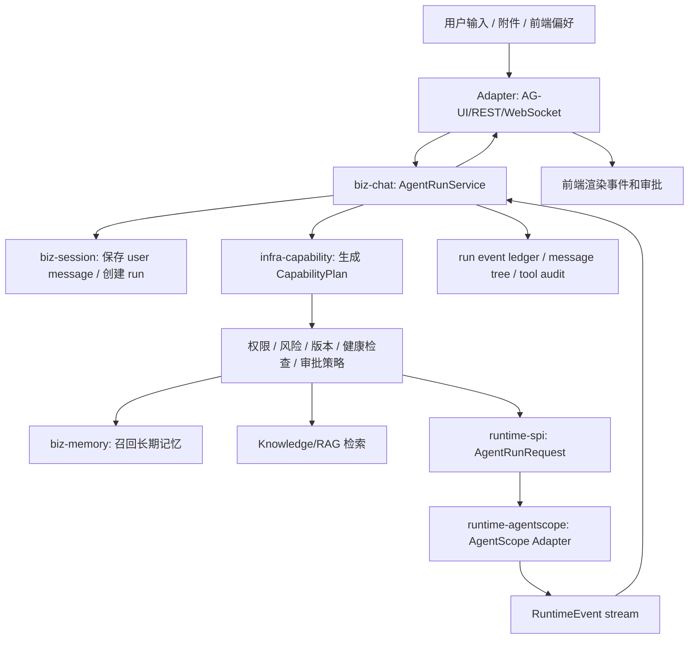

# Agent 部分竞品对比调研与优化建议

调研日期：2026-05-23  
调研对象：OpenCode、OpenAI Codex、Claude Code、OpenClaw、Hermes Agent、Qwen Code（用户写作 qwencode）及当前项目 Agent 实现。  
说明：Claude Code 不是开源实现，本节按官方文档对照；其余项目以官方仓库或官方文档为主。

## 结论先行

当前项目已经具备 AgentScope ReActAgent、Tool、Skill、MCP、Knowledge、Hook、AG-UI 流式事件、会话树和 AgentScope 状态持久化等基础能力，但 Agent 运行链路还没有形成一个稳定的“后端运行中枢”。最需要优先优化的是：

1. 后端接管 Run/Message/Event 持久化，前端只渲染流式事件，不再负责保存 assistant/tool/error 消息。
2. 把 Tool、MCP、Skill、Hook、Knowledge、CodeExecution 统一成“能力计划”，在运行前做权限、风险、可用性、版本和审计决策。
3. Skill 改成“索引可发现、内容按需加载、调用可审计、工具权限可限制”的模型，避免把技能正文、示例、脚本一次性塞进 Agent。
4. 区分三类记忆：会话历史、上下文压缩、长期用户/项目记忆。当前 AutoContextMemory 更接近上下文压缩，不应承担用户长期记忆。
5. 对动态 Groovy 工具/Hook、MCP、代码执行、文件写入、网络访问建立统一安全边界和批准策略。
6. 将 `biz-chat`、`biz-session`、`biz-memory` 等空模块真正承接业务职责，避免继续把聊天、运行时状态和 AgentScope 细节集中在 `biz-agent` 与 `agent-boot`。

## 当前项目现状

已具备的基础能力：

- `ReActAgentHelper` 负责拼装模型、系统提示、SkillBox、Toolkit、Knowledge、PlanNotebook、Memory、Hooks、Studio 和工具执行上下文。
- `ToolkitFactory` 支持内置工具、动态工具、代码执行工作区工具、MCP 懒加载工具、Agent as Tool，并设置 60 秒执行超时。
- `SkillBoxFactory` 支持技能包、资源、示例、脚本、技能关联工具和代码执行工作区 Skill。
- `McpClientFactory` 支持 stdio/http/sse 协议、MCP 工具目录缓存、按绑定过滤、懒连接、共享客户端上下文、失败降级。
- `ChatSessionServiceImpl` 使用消息树和 materialized path 支持分支、重新生成和当前路径回显。
- `PostgresSession` 已将 AgentScope Session 状态落库，`AguiRequestProcessor` 会在记忆开启时执行 `loadFrom/saveTo`。
- 前端 `useChatStream.ts` 能处理 AG-UI 流式文本、reasoning、tool call、error，并按队列调用 `appendMessage` 保证写入顺序。

主要问题：

- Assistant、reasoning、tool、error 消息由前端根据流式事件调用 `appendMessage` 保存。刷新、断线、并发窗口、前端异常、重复回放都会影响历史一致性。
- `AgentContext` 依赖 `InheritableThreadLocal` 传递 threadId、runId、userInfo、memoryActive、planActive、fileIds 等运行态参数，在 WebFlux/异步/工具线程中有上下文泄漏或丢失风险。
- 当前“记忆开启”同时影响 Memory、Plan 持久化、工具确认逻辑，语义过载。`ToolkitFactory` 中 `needConfirm && isMemoryActive` 才设置确认，权限边界与记忆开关耦合。
- `SkillPackage` 只有 name、description、skillContent、references、examples、scripts，缺少版本、输入输出契约、触发条件、适用路径、权限、风险等级、依赖、签名、安装来源、审核状态。
- Skill 当前在构建 Agent 时注册完整内容，缺少类似 OpenCode/Claude/Qwen 的“模型先看到技能索引，必要时再加载完整 Skill”的机制。
- 动态工具和 Hook 通过 GroovyClassLoader 解析源码，并支持 Spring 依赖注入；这很强，但缺少沙箱、权限最小化、代码签名、执行审计、缓存失效和供应链控制。
- `agent-boot` 下存在对 AgentScope AG-UI 类的覆盖实现，业务代码中也有直接 SQL 查询和 AgentScope 类型暴露，和 RTK 中“AgentScope 专属类型限制在 runtime/adapter”的目标边界不一致。
- `biz-chat`、`biz-memory`、`biz-session` 目前基本未承接实现，聊天、会话、记忆职责仍散落在 `biz-agent`、`agent-boot`、前端组合函数和 AgentScope Session 中。

## 竞品可吸收模式

| 实现 | 可吸收点 | 对当前项目的启发 |
| --- | --- | --- |
| OpenCode | Agent 可用 JSON 或 Markdown 配置；primary/subagent 分层；权限使用 `ask/allow/deny`，并支持 glob 精细控制；Skill 由原生 `skill` tool 按需加载完整内容；MCP 工具按服务器名前缀统一纳入权限。 | 需要把工具、MCP、Skill、子 Agent 都纳入统一权限模型；Skill 不应默认全量注入；管理后台可以提供 JSON/Markdown 双形态导入导出。 |
| Codex | Rust CLI 维护 `config.toml`；MCP client/server 双向支持；MCP server 暴露 thread/start、thread/resume、turn/start、turn/interrupt、thread/read/list、approval 等接口；运行事件通过通知流输出；沙箱策略有 read-only、workspace-write、danger-full-access。 | 后端应抽象 Thread/Turn/Run API 和事件流，不让前端拼装历史；审批是运行协议的一部分；沙箱和写入根目录应成为 AgentRun 的显式配置。 |
| Claude Code | `CLAUDE.md` 分企业、项目、用户、项目本地层级；Skill 是 `SKILL.md` 目录，可自动触发或 slash 调用，支持 supporting files、allowed-tools、skillOverrides、压缩后重挂载预算；MCP 有 local/project/user scope；settings 支持权限 deny、hooks、敏感文件排除。 | 当前项目需要长期记忆层级、Skill 支持文件、Skill 可见性覆盖、工具预授权和敏感资源 denylist；压缩后要知道哪些 Skill 仍在上下文中。 |
| OpenClaw | 将 Tools、Skills、Plugins 作为三种能力面：Tool 是可调用动作，Skill 是提示/流程包，Plugin 是带代码、凭证、生命周期和打包的运行能力；工具可见性需经过 profile、allow/deny、sandbox、channel 和 plugin 可用性过滤。 | 建议引入统一 CapabilityRegistry/CapabilityPlan，不同能力先通过治理过滤，过滤后才给模型看；没有满足 allowlist 的工具时应 fail-closed。 |
| Hermes Agent | 会话自动保存到 SQLite，含系统提示快照、完整消息、工具调用/结果、token、父会话；FTS5 支持跨会话搜索；Memory 分 `MEMORY.md` 和 `USER.md`，有硬上限并在会话开始作为冻结快照注入；session_search 和 memory 职责分离。 | 当前项目应把“完整历史搜索”和“长期记忆注入”分开；长期记忆必须小、可解释、可删除、有来源；完整会话应可搜索、可恢复、可剪枝。 |
| Qwen Code | `QWEN.md` 和 `AGENTS.md` 作为上下文文件；Auto-memory 有 Extract、Dream、Recall、Forget 生命周期；Skill 支持 personal/project/extension 目录和 `paths` 路径门控；MCP 支持 project/user scope、includeTools/excludeTools、trust、OAuth token 管理。 | 可以借鉴记忆生命周期、路径门控 Skill、MCP 工具过滤、OAuth token 托管；记忆写入不应等同于保存聊天全文。 |

## P0：优先优化

### 1. 建立后端 AgentRunService

目标：后端成为每次运行的唯一事实源。

建议落点：

- `agent-biz/biz-chat`：新增 `AgentRunService`，负责创建 run、追加 user message、启动 runtime、消费流式事件、保存 assistant/tool/error/final 状态。
- `agent-adapter` 或现有 AG-UI adapter：只负责协议转换和流式响应。
- 前端：删除 assistant/tool/error 的主动 `appendMessage`，改为消费后端事件和查询后端最终历史。

短期兼容策略：

- 第一阶段若不能新增表，可先沿用 `chat_message.content` 的 JSON 结构保存 runId、messageId、eventType、toolCallId、reasoning/content/toolResult。
- 第二阶段再引入 `agent_run`、`agent_run_event`、`agent_tool_call`、`agent_artifact` 或等价表。

必须记录的运行事件：

- run_started、user_message_saved、assistant_message_delta、assistant_message_completed
- reasoning_delta、tool_call_started、tool_call_args_delta、tool_call_completed、tool_call_failed
- skill_loaded、mcp_connected、mcp_degraded、approval_requested、approval_resolved
- run_cancelled、run_failed、run_finished

### 2. 统一运行时契约，降低 AgentScope 泄漏

建议在 `runtime-spi` 定义：

- `AgentRunRequest`：agentId、sessionId、runId、userId、messages、attachments、runtimeOptions。
- `RuntimeCapabilityPlan`：本次运行可见的 tools、mcpTools、skills、hooks、knowledge、codeExecution、subAgents。
- `RuntimeEvent`：统一事件模型，AG-UI、WebSocket、REST 都从这里转换。
- `RuntimeResult`：最终消息、token、tool calls、artifacts、状态。
- `RuntimeContext`：替代或收敛 `AgentContext`，显式传入运行链路。

`runtime-agentscope` 只消费 SPI 对象并适配到 AgentScope，不再让业务层依赖 AgentScope 类型。

### 3. 引入 CapabilityPlan 与权限治理

运行前先做能力解析：

1. 读取 AgentDefinition、Tool、MCP、Skill、Hook、Knowledge、CodeExecution、SubAgent 绑定。
2. 校验启用状态、版本、健康状态、用户/租户授权、风险等级、审批策略。
3. 生成本次运行的 `CapabilityPlan`，带上来源、版本、hash、可见名、权限结果、审计要求。
4. 只把通过治理的能力暴露给模型。

权限动作建议统一为：

- `allow`：直接可用。
- `ask`：调用前需要用户或策略审批。
- `deny`：对模型不可见，调用时也拒绝。
- `shadow`：对模型不可见，但平台可用于后台观测或诊断。

这样可以修复当前 `needConfirm` 与 `memoryActive` 耦合的问题。

### 4. 重构 Skill 调用模型

当前 `SkillBoxFactory` 构建 Skill 时会注册技能正文、资源、示例、脚本和关联工具。建议拆成三层：

- Skill Index：只包含 name、description、category、triggers、paths、risk、version、owner，常驻给模型选择。
- Skill Load：模型或用户选择后，才把 `SKILL.md` 主体和必要 supporting files 注入上下文。
- Skill Execute：如果 Skill 需要脚本、工具或 MCP，必须经过 CapabilityPlan 权限过滤和审计。

建议扩展 Skill 元数据：

| 字段 | 作用 |
| --- | --- |
| `name` / `description` | 模型发现入口，描述要包含触发词和适用场景。 |
| `version` / `source` / `hash` | 版本追踪、回滚、供应链审计。 |
| `triggers` / `paths` | 自动触发条件和路径门控，降低无关 Skill 干扰。 |
| `inputSchema` / `outputContract` | 约束技能入参和产出，便于 UI/审批/评测。 |
| `allowedTools` / `allowedMcpServers` | Skill 级最小权限。 |
| `requiredEnv` / `requiredCredentials` | 声明式凭证需求，运行时只注入必要 secret。 |
| `riskLevel` / `requiresApproval` | 高风险 Skill 默认 ask。 |
| `examples` / `references` / `scripts` | 作为 supporting files，按需加载或执行。 |

Skill 调用需要落审计：

- 触发方式：模型自动、用户 slash、hook、subagent。
- 命中的描述或路径门控。
- 加载的资源文件和 token 量。
- Skill 调用期间实际使用的 tool/MCP/subagent。
- 最终是否成功、是否被拒绝、是否触发审批。

### 5. 拆分长期记忆、会话历史和上下文压缩

建议定义三类不同能力：

| 类型 | 目的 | 当前对应 | 建议归属 |
| --- | --- | --- | --- |
| 会话历史 | 重放当前会话、分支、恢复、审计 | `chat_message`、AgentScope Session | `biz-session` / `biz-chat` |
| 上下文压缩 | 控制单次模型上下文长度 | `AutoContextMemory` | `runtime-agentscope` 的运行时优化 |
| 长期记忆 | 跨会话保存用户偏好、项目事实、长期约束 | 当前缺口 | `biz-memory` |

长期记忆建议具备：

- 类型：user_profile、preference、project_fact、workflow_rule、external_reference、agent_lesson。
- 作用域：user、agent、workspace、tenant、global。
- 来源：sourceRunId、sourceMessageId、createdBy（user/agent/admin）、createdAt。
- 质量：confidence、lastUsedAt、expiresAt、supersedes、status。
- 操作：extract、recall、review、forget、compact。
- 注入策略：按当前请求相关性和 token budget 选择，不把全部记忆硬塞进 prompt。
- 人机控制：用户可查看、编辑、禁用、删除，敏感记忆需确认后保存。

短期可先做“手动记忆”和“确认式自动提取”，不要一开始全自动写入。

## P1：第二阶段优化

### 1. 会话记录升级为事件账本

保留现有消息树用于分支和回显，同时补一个 run/event 视角：

- message tree：面向用户 UI，表达对话分支、重新生成、编辑后重发。
- event ledger：面向运行时和审计，记录完整流式事件、工具参数、工具结果、错误、审批、token 和耗时。
- session summary/checkpoint：面向长会话压缩和恢复，记录压缩摘要和父子 lineage。

Hermes 的经验值得吸收：完整历史用于搜索和审计，长期记忆只保存关键事实。

### 2. MCP 管理增强

当前 MCP 已有目录缓存、懒加载和降级，下一步建议补：

- 服务器级、工具级 include/exclude/ask/allow/deny。
- Schema diff：工具目录变化时记录新增、删除、参数变化、风险变化。
- OAuth/token 托管：secret 只保存引用，不落明文配置。
- 输出限制：大结果截断、摘要、artifact 化，避免工具输出撑爆上下文。
- 工具名前缀命名空间：防止不同 MCP 工具名冲突。
- 动态工具变更：支持 MCP `tools/list_changed` 后刷新目录，刷新过程加锁。
- MCP 资源和 prompts 是否暴露要可配置，默认最小暴露。

### 3. 动态工具与 Hook 安全边界

Groovy 动态代码是高风险能力。建议：

- 管理端引入审核状态：draft、reviewing、approved、disabled、revoked。
- 保存代码 hash、作者、审核人、发布时间、依赖、权限声明。
- 运行时隔离：优先走 sandbox/runtime-execution，不直接在主 JVM 内执行未知代码。
- 禁止默认 Spring Bean 任意注入，改成白名单服务注入。
- 统一超时、内存、输出大小、网络、文件系统限制。
- 失败和异常要写入工具调用审计，不只返回 `R.fail(e.getMessage())`。

### 4. 上下文预算与压缩策略

竞品共同趋势是把上下文拆成可预算块：

- 系统提示、Agent 指令、项目上下文、长期记忆、当前会话、Skill、Tool schema、MCP schema、Knowledge 检索、附件摘要。

建议每次运行生成 `ContextBudgetReport`：

- 每块 token 估算。
- 被注入/被丢弃/被摘要的原因。
- Skill/MCP/Knowledge 各占多少。
- 接近上限时优先裁剪低价值内容，而不是简单保留最近消息。

### 5. 子 Agent 与任务隔离

当前支持 Agent as Tool。下一步可以补：

- 子 Agent 权限独立，不继承父 Agent 全部工具。
- 子 Agent 输出结构化摘要，不把全部中间历史污染主会话。
- 子 Agent 可并发，但有预算、超时、取消和工作区隔离。
- 子 Agent 调用同样进入 run/event 审计。

## P2：后续增强

- 多渠道会话：Web、API、IM、自动任务统一进入 Session/Run 模型。
- 后台任务与调度：把 Cron/Heartbeat/long-running task 作为 AgentRun 的来源之一。
- Artifact 模型：文件、图片、表格、报告、代码变更作为 artifact 记录，消息只引用 artifact。
- Prompt injection 防护：工具输出、网页内容、MCP 资源、上传文件默认视为不可信内容，进入隔离块并加 provenance。
- 评测体系：为 Skill 触发率、工具选择、MCP 降级、记忆召回、会话恢复建立回归集。
- 数据治理：会话保留期、删除策略、导出、敏感信息脱敏、租户隔离。
- 供应链：Skill/MCP/Plugin 安装源、签名、hash、恶意模式扫描、撤销列表。

## 推荐模块落点

| 模块 | 建议职责 |
| --- | --- |
| `agent-biz/biz-chat` | `AgentRunService`、运行状态机、消息保存、流式事件消费、取消/重试。 |
| `agent-biz/biz-session` | 会话树、分支、标题、搜索、压缩 checkpoint、恢复。 |
| `agent-biz/biz-memory` | 长期记忆 CRUD、提取、召回、遗忘、审核、注入策略。 |
| `agent-infra/infra-capability` | CapabilityRegistry、CapabilityPlan、权限决策、风险评估、能力版本。 |
| `agent-infra/infra-security` | 工具审批、secret 引用、动态代码沙箱、文件/网络策略、prompt injection 扫描。 |
| `agent-infra/infra-observability` | run trace、tool span、token/cost、事件审计、异常聚合。 |
| `agent-runtimes/runtime-spi` | RuntimeRequest、RuntimeEvent、RuntimeResult、RuntimeContext、RuntimeCapabilityPlan。 |
| `agent-runtimes/runtime-agentscope` | AgentScope 适配器，只做运行时装配和事件转换。 |
| `agent-admin/admin-capability` | Tool/MCP/Skill/Hook 管理、审核、发布、回滚、权限模板。 |
| `agent-adapter` | AG-UI/REST/WebSocket 协议适配，不承载业务持久化逻辑。 |
| `source/agent-platform-ui` | 只做用户输入、事件渲染、审批交互、历史查询，不再自行生成历史事实。 |

## 建议目标链路

## 分阶段落地路线

### 阶段 1：不大改表，先收敛权责

- 新增 `AgentRunService`，后端消费 AG-UI 事件并保存 assistant/tool/error。
- 前端停止主动保存 assistant/tool/error，只保存用户输入或调用发送接口。
- 新增 `RuntimeContext`，逐步替换 ThreadLocal 依赖。
- 新增 `CapabilityPlan` 对象，先覆盖 Tool/MCP/Skill 可见性和审批策略。
- Skill 元数据先用现有 `SkillPackage` JSON 字段兼容扩展。

### 阶段 2：补事件账本和长期记忆

- 新增 run/event/tool_call/artifact 或等价持久化结构。
- `biz-memory` 支持手动记忆、确认式自动提取、召回和删除。
- 会话搜索从消息树扩展到全文检索和运行事件检索。
- MCP schema diff、输出限制、OAuth token 引用落地。

### 阶段 3：能力市场与安全体系

- Skill/MCP/Tool/Hook 统一发布审核、版本、签名、回滚。
- 动态代码进入沙箱执行。
- 引入评测和安全扫描，覆盖 Skill 触发、工具调用、记忆召回、提示注入。
- 支持多渠道、后台任务、子 Agent 并发和隔离工作区。

## 需要避免的方向

- 不要把长期记忆继续做成“AgentScope Memory 保存更多消息”。这会混淆压缩、历史和用户画像。
- 不要让前端继续生成历史事实。前端可以乐观渲染，但最终历史必须以后端 run/event 为准。
- 不要把所有 Skill 内容常驻 prompt。Skill 越多，越会稀释指令并增加错误触发。
- 不要让 MCP、动态工具、代码执行绕过统一权限。模型能看到的能力必须是治理后的能力。
- 不要在业务层继续扩散 AgentScope 类型。AgentScope 应是 runtime 实现细节。
- 不要把记忆自动写入做成黑盒。用户必须能看见、修改、删除，敏感条目默认确认。

## 参考来源

- OpenCode Agents 官方文档：https://opencode.ai/docs/agents/
- OpenCode Skills 官方文档：https://opencode.ai/docs/skills/
- OpenCode MCP 官方文档：https://opencode.ai/docs/mcp-servers
- OpenAI Codex CLI 仓库 README：https://github.com/openai/codex/blob/main/codex-rs/README.md
- OpenAI Codex MCP server interface：https://github.com/openai/codex/blob/main/codex-rs/docs/codex_mcp_interface.md
- OpenAI Docs MCP：https://developers.openai.com/learn/docs-mcp
- OpenAI Codex agent internet access：https://developers.openai.com/codex/cloud/internet-access
- Claude Code Memory 官方文档：https://docs.anthropic.com/en/docs/claude-code/memory
- Claude Code MCP 官方文档：https://docs.anthropic.com/en/docs/claude-code/mcp
- Claude Code Settings 官方文档：https://docs.anthropic.com/en/docs/claude-code/settings
- Claude Code Skills 官方文档：https://code.claude.com/docs/en/skills
- OpenClaw Tools/Skills 官方仓库文档：https://github.com/openclaw/openclaw/blob/main/docs/tools/index.md
- OpenClaw Skills 官方仓库文档：https://github.com/openclaw/openclaw/blob/main/docs/tools/skills.md
- Hermes Agent 官方仓库：https://github.com/NousResearch/hermes-agent
- Hermes Agent Memory 官方文档：https://hermes-agent.nousresearch.com/docs/user-guide/features/memory/
- Hermes Agent Sessions 官方文档：https://hermes-agent.nousresearch.com/docs/user-guide/sessions
- Hermes Agent MCP 官方文档：https://hermes-agent.nousresearch.com/docs/user-guide/features/mcp
- Hermes Agent Creating Skills 官方文档：https://hermes-agent.nousresearch.com/docs/developer-guide/creating-skills
- Qwen Code Memory 官方文档：https://qwenlm.github.io/qwen-code-docs/en/users/features/memory/
- Qwen Code Auto Memory 设计文档：https://qwenlm.github.io/qwen-code-docs/en/design/auto-memory/memory-system/
- Qwen Code Skills 官方文档：https://qwenlm.github.io/qwen-code-docs/en/users/features/skills/
- Qwen Code MCP 官方文档：https://qwenlm.github.io/qwen-code-docs/en/users/features/mcp/
- Qwen Code Core 官方文档：https://qwenlm.github.io/qwen-code-docs/en/core/
